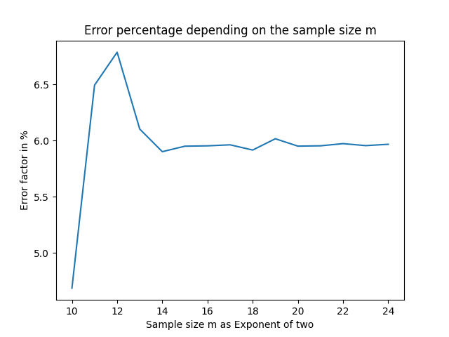
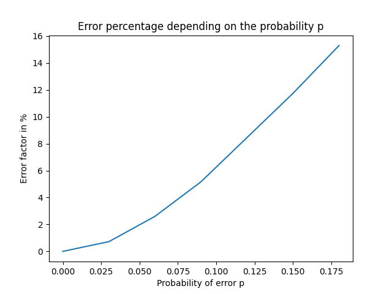
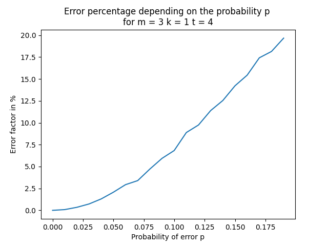
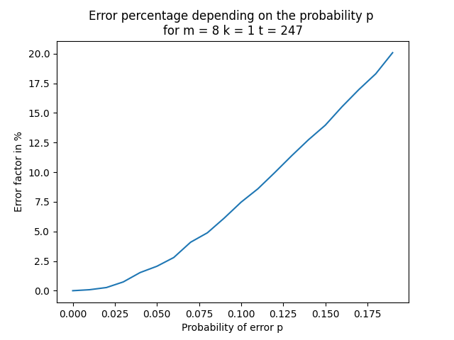
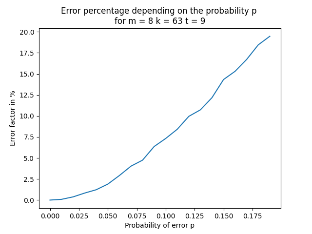

# Forward error correction

 

### Piotr Łach 

### Jakub Szpak 

 
 

### Model symulacyjny zbudowano z pomocą języka Python. Zaimplementowano następujące klasy: 
- koder
- kanał
- dekoder

Koder ma za zadanie zakodowanie wiadomości wejściowej przez potrojenie każdego bitu. W związku z tym wysyłana wiadomość ma trzykrotnie większy rozmiar niż wiadomość wejściowa.

Kanał zakłóca przesyłaną wiadomość z prawdopodobieństwem wejściowym p. Zakłócenie polega na odwróceniu wartości bitu. 

Dekoder dekoduje odebraną wiadomość poprzez sprawdzenie każdej trójki bitów i wpisanie do zdekodowanej wiadomości wartości bitu występującego więcej razy. 

### Eksperyment nr 1:
 - Wygenerowano ciąg bitów wielkości 2^18 = 262144
 - Zakodowano go przez potrojenie każdego bitu
 - Ciąg umieszczono w symulatorze kanału transmisyjnego, który w zależności od prawdopodobieństwa p zamieniał bity w ciągu na przeciwne. Dobrano prawdopodobieństwa z przedziału [0;30]%
 - Otrzymano następujące wartości przekłamań:
  
   

 
 

### Eksperyment nr 2:
 - Wygenerowano ciąg bitów wielkości 2^m, m in range [10,24]
 - Zakodowano go przez potrojenie każdego bitu
 - Ciąg umieszczono w symulatorze kanału transmisyjnego, który ze stałym prawdopodobieństwem 0,15 zamieniał bity w ciągu na przeciwne 
 - Otrzymano następujące wartości przekłamań

 

 
 

## Optymalizacja systemu 
System zoptymalizowano poprzez zastosowanie kodów BCH, zamiast stałego potrajania bitów. Zmodyfikowano koder i dekoder. W celu spełnienia założeń wykorzystaliśmy klasę BCHCode z biblioteki komm.

## Eksperymenty z kodami BCH

### Eksperyment pierwszy

W pierwszym z eksperymentów przygotowaliśmy słownik parametrów BCH dla m od 3 do 8. Każda jedna wartość na osi x to średnia z pomiarów dla każdej kombinacji parametrów. 

m - określa długość słowa kodowego n = 2^m - 1  
t - zdolność korekcyjna  
k - długość pojedynczego pakietu

 

 

Przeprowadzając pomiar w ten sposób otrzymaliśmy mniejsze wartości błędów niż dla prostego kodu potrajającego.  

 

### Indywidualna analiza parametrów

Wykonano 10 eksperymentów wykorzystując różne parametry kodów na wiadomości o rozmiarze 2048b. Dla każdego z eksperymentów generowano nową populację dziesięciokrotnie. Wyniki są uśrednione. 

 

