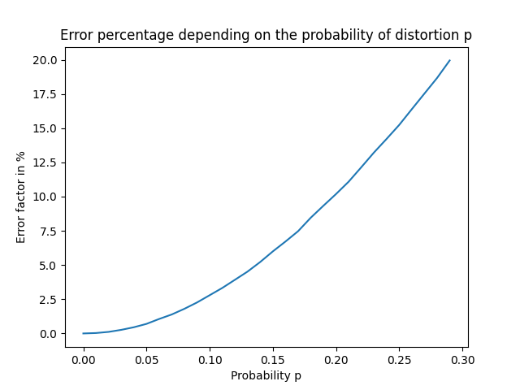

## Forward error correction

 

### Piotr Łach
### Jakub Szpak

 
 

Dla wygenerowanego ciągu bitów wielkości 2^18 = 262144, następnie zakodowanego przez potrojenie każdego bitu -> 2^18*3 w zależności od prawdopodobieństwa p, tj. prawdopodobieństwa zmianu bitu w ciągu na przeciwny otrzymano następujące przekłamania [%].

